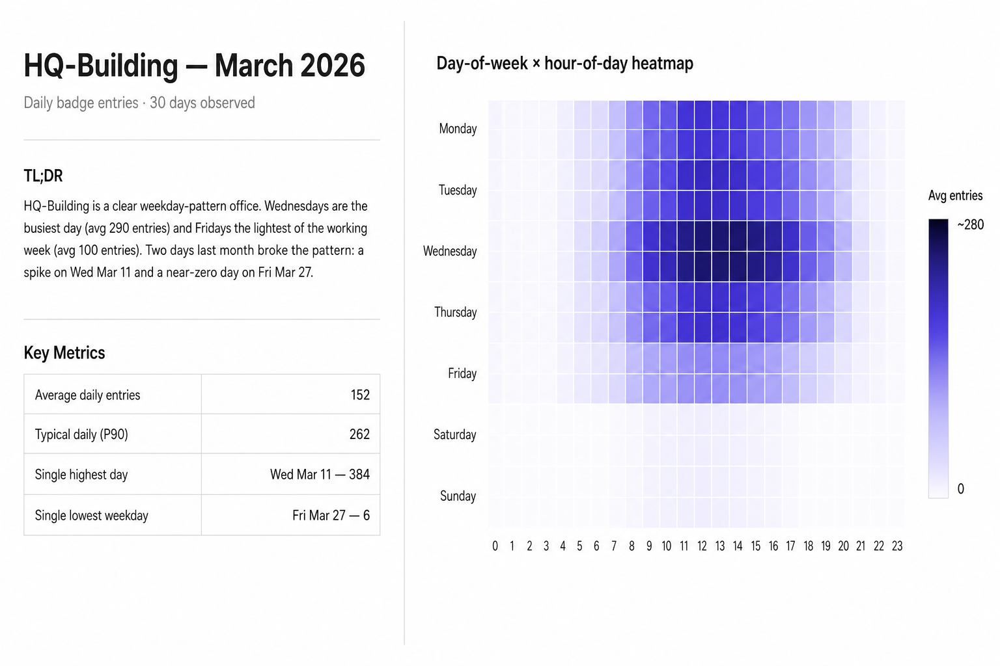

# Occupancy Insights — an agentic skill

Turn raw occupancy data — Wi-Fi data, badge swipes, sensor data, room reservations, manual surveys — into a clean, decision-ready space-utilization report. Vendor-neutral. MIT licensed.

Built by [Occuspace](https://occuspace.com).



---

## What it does

Markdown instructions that teach an AI assistant how to analyze occupancy data. The format follows Anthropic's [Agent Skills spec](https://platform.claude.com/docs/en/agents-and-tools/agent-skills), but the contents are plain text — **Claude, ChatGPT, Gemini, and other LLMs can all use it.** Set up once (see Install), then share your data and ask.

You get back:

- **Headline metrics** — average daily peak, typical daily peak (P90), single highest peak, Utilization vs. capacity
- **Patterns** — by day of week, by hour of day, plus a day-of-week × hour-of-day heatmap
- **Trend detection** — linear regression with R², gated at a 90-day minimum (shorter windows are dominated by weekly seasonality)
- **Anomaly flags** — days that look unusual versus their same-day-of-week baseline
- **Source-aware caveats** — Wi-Fi devices ≠ headcount, badge swipes ≠ occupancy, reservations ≠ presence
- **Prioritized recommendations** — specific, scoped, testable actions tied to a finding

Two output modes: **inline markdown** for quick questions in chat, or a **self-contained HTML report** when you ask for a deliverable. See [`examples/example-report.md`](examples/example-report.md) (chat answer) and [`examples/example-report.html`](examples/example-report.html) (deliverable) for what each looks like.

## Why we built this

At [Occuspace](https://occuspace.com), we've spent 7 years analyzing occupancy and utilization data across 1000+ buildings and 40 million square feet. This skill packages what we've learned about *how to frame* that data — what to compare to what, when a trend is real vs. noise, what makes a recommendation actionable. The framing is the part that's portable.

## Install

### Option 1 — Claude.ai project (lowest friction, no install)

1. Open a new Project at [claude.ai](https://claude.ai).
2. Paste [`SKILL.md`](SKILL.md) into the Project's **custom instructions**.
3. Upload [`references/analysis-recipes.md`](references/analysis-recipes.md), [`references/writing-style.md`](references/writing-style.md), and [`references/multi-source-data.md`](references/multi-source-data.md) as project files.
4. Share your CSV and ask Claude to analyze it.

The optional Python helpers don't run here, but Claude's analysis tool can compute the same math when needed.

### Option 2 — Claude Code / Claude Desktop

```bash
git clone https://github.com/Waitz-Inc/occupancy-insights-skill ~/.claude/skills/occupancy-insights
```

Restart [Claude Code](https://www.anthropic.com/claude-code) if it was open — the skill auto-discovers. Update later with `git pull` from the same directory.

### Option 3 — ChatGPT, Gemini, or any other AI assistant

Same pattern across platforms: paste [`SKILL.md`](SKILL.md) as the assistant's instructions, attach the three [`references/`](references/) files, and enable code execution if you want the Python helpers to run.

- **ChatGPT (Custom GPT)** — instructions field + Knowledge files + Code Interpreter
- **Gemini (Gem)** — instructions field + attached files + code execution
- **Direct API** — `SKILL.md` as system prompt + references in context

Output quality scales with the model. The skill produces useful reports on any capable instruction-following LLM.

## How to use it

Share your data and ask. Examples:

- *"Here's a CSV of Wi-Fi data for our HQ for the last 4 months. How busy was it? Any trends?"*
- *"This is daily badge swipe data for our research building. What's the day-of-week pattern? Any unusual days?"*
- *"Here's sensor data for our café over Q1. Build me a heatmap and tell me when to schedule cleaning."*

The assistant figures out your column layout, asks one or two clarifying questions if needed, and produces a structured report (see [`examples/example-report.md`](examples/example-report.md)).

## What's in the box

```
occupancy-insights-skill/
├── SKILL.md                       Main skill instructions (~180 lines)
├── references/
│   ├── analysis-recipes.md        Concrete recipes: peaks, DOW, heatmap, trend, anomalies
│   ├── writing-style.md           How the report should read
│   └── multi-source-data.md       Wi-Fi vs badge vs sensor vs reservations vs manual
├── scripts/
│   ├── compute_trend.py           Stdlib-only linear regression + 90-day guard
│   └── detect_anomalies.py        Stdlib-only z-score vs same-DOW baseline
├── examples/
│   ├── sample-wifi.csv            30 days of hourly Wi-Fi device counts
│   ├── sample-badge.csv           30 days of daily badge entries
│   └── example-report.md          What the skill produces on the sample data
└── LICENSE                        MIT
```

## Data formats it accepts

The skill auto-detects columns by content, not by name. Bring a CSV with at least a timestamp and a count — it figures out the rest. The table below is just to set expectations on which kinds of data work.

| Source | Common vendors | Typical columns |
|---|---|---|
| **Wi-Fi presence** | Cisco Spaces, Cisco Meraki, Aruba ALE | timestamp, location, device count |
| **Access control** | Kastle, HID, Genetec | event time, reader/door, cardholder, event type |
| **Sensor headcount** | Occuspace, Density, Butlr, VergeSense, XY Sense, RZero, Freespace | timestamp, space, count, capacity |
| **Reservation systems** | Microsoft Graph (Outlook/Teams), Google Calendar, Kadence, Robin, Condeco, Envoy, Spaceti | start, end, room, attendees |
| **Manual surveys** | Spreadsheets, observation apps | date, time, space, observed count |

Date formats: ISO-8601 (`2026-01-15`), `YYYY-MM-DDTHH:MM:SS`, `MM/DD/YYYY`, `DD/MM/YYYY`, ms-epoch integers. Custom formats work via the `--date-format` flag on the helper scripts.

## What this skill won't do

Kept lite on purpose. It won't:

- **Pull data for you.** Bring your own CSV.
- **Predict the future.** It describes what happened — it doesn't forecast.
- **Detect data quality issues** like sensor outages, flatlines, or coverage gaps.
- **Discover operating hours automatically.** You tell it the hours, or it reports 24/7 with a caveat.
- **Roll up portfolios** of more than a handful of spaces.
- **Run in real time.**

If any of those matter for your use case, that's where [Occuspace](https://occuspace.com) comes in.

## Ready for the next level?

When you're ready for:

- **Real-time utilization data** at minute-level resolution
- **Automatic operating-hours discovery** from your actual usage patterns
- **Portfolio rollups** across hundreds of spaces and floors
- **A managed dashboard + AI analyst** that proactively surfaces what changed and why

→ Talk to us at [occuspace.com](https://occuspace.com).

## Contributing

Issues and pull requests welcome. The most useful feedback is misleading-framing examples — open an issue with the input shape and what you'd expect instead.

## License

[MIT](LICENSE) — use it commercially, fork it, embed it in client deliverables. No attribution required, but appreciated.
